# Exercise screenshot references

Captured from the running solution apps on 22 September 2026. These are reference outcomes, not the unfinished exercise starters. Screenshots use local mock data. The release toggle affects one browser session only.

## Exercise 01 — healthy catalog

Solution reference: the product catalog renders when the mock dependency succeeds. Product photos are placeholder fixtures.

## Exercise 01 — circuit protection

Solution reference: the failing product dependency produces an explicit unavailable message and circuit-protection banner. The empty list is a fallback, not evidence of an empty catalog.

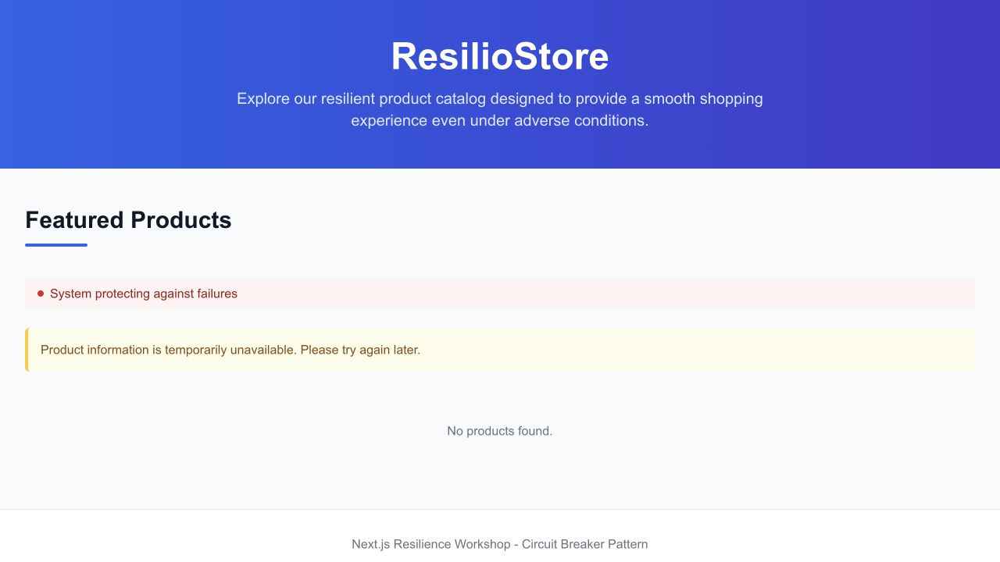

## Exercise 02 — server deadline

Solution reference: server prefetch stops waiting after 500ms; loading placeholders remain while the browser starts its own request. The timeout does not cancel the original request.

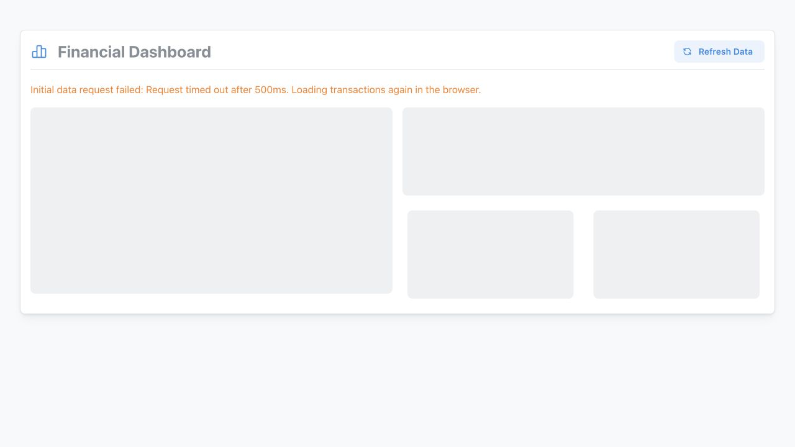

## Exercise 02 — browser recovery

Solution reference: the slower browser request completes and replaces the loading state with transaction data.

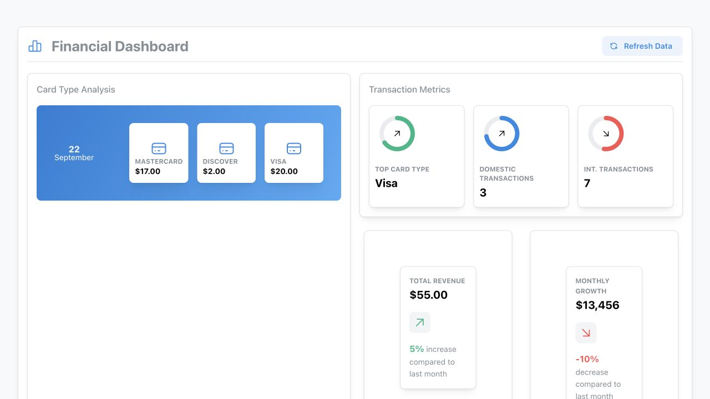

## Exercise 03 — healthy quadrants

Solution reference: the dashboard before a render failure. Each quadrant provides a separate interaction.

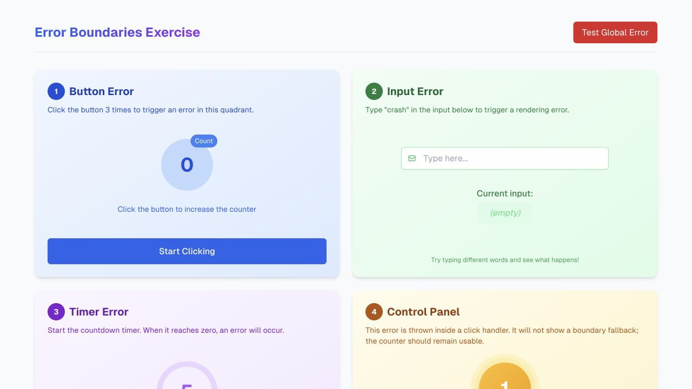

## Exercise 03 — isolated render failure

Solution reference: quadrant 1 displays its Retry fallback; the timer remains at 5 and the independent control-panel count remains at 1.

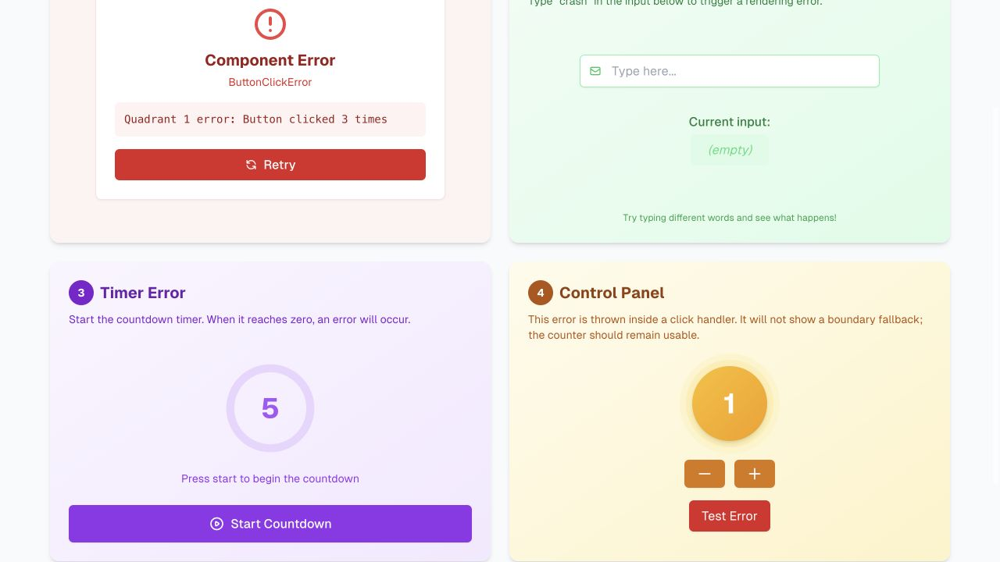

## Exercise 04 — healthy analytics

Solution reference: optional analytics renders beneath the core transaction information.

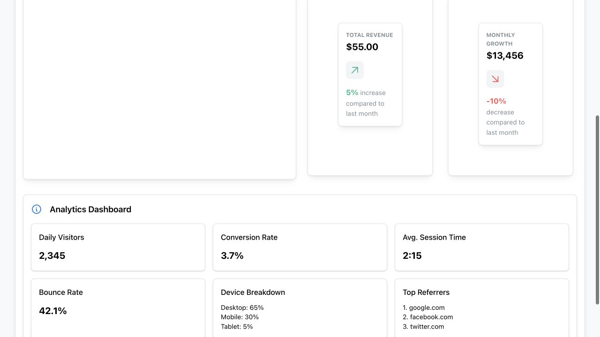

## Exercise 04 — optional failure

Solution reference: analytics is unavailable while transaction revenue remains visible. Unavailable data is distinct from a successful empty response.

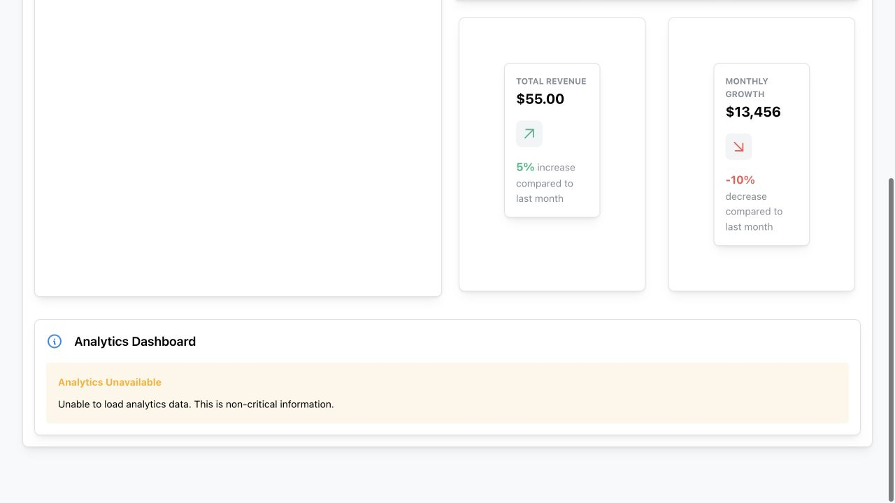

## Exercise 04 — critical failure

Solution reference: failed server-side transaction loading produces the page-level Server Error fallback. The demo message about notification is UI copy, not proof that remote telemetry was delivered.

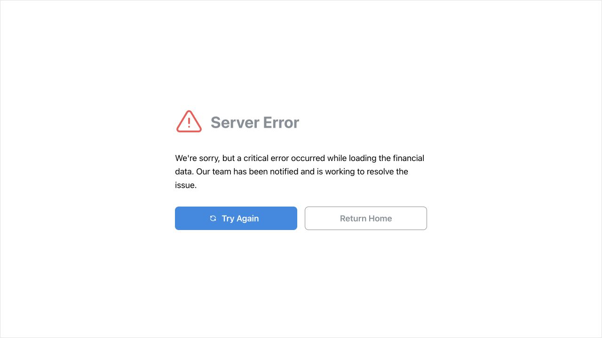

## Release demo — diagnose

Local demonstration: the incident record identifies the analytics feature, error label, demo release and flag value at failure.

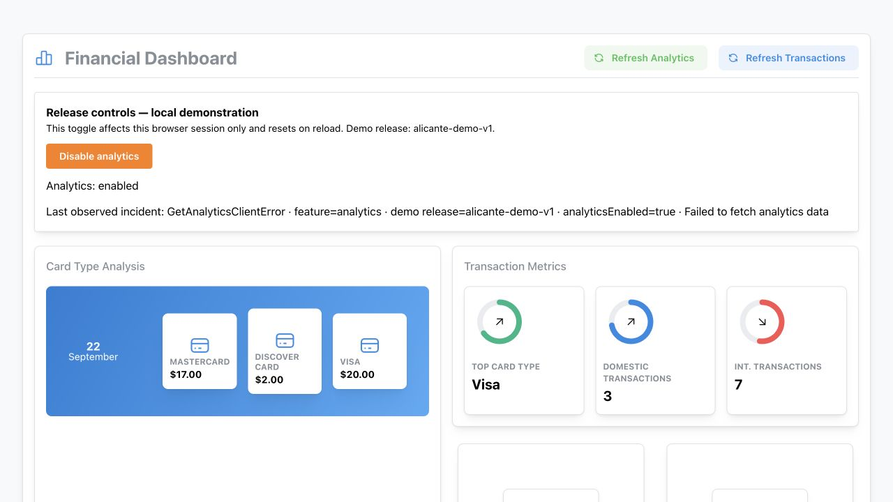

## Release demo — contain

Local demonstration: disabling analytics replaces the error with an intentional disabled state while transaction revenue remains available.

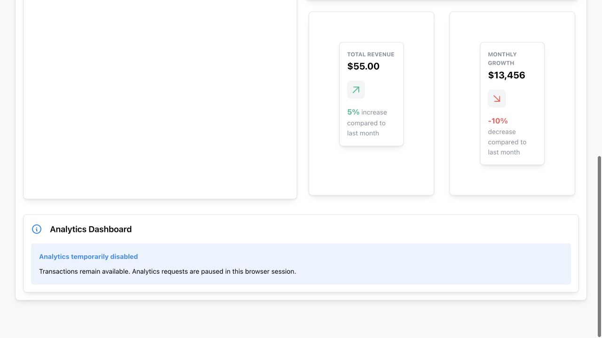

## Release demo — restore

Local demonstration: after repairing the mock dependency and enabling analytics, fresh analytics data renders again.

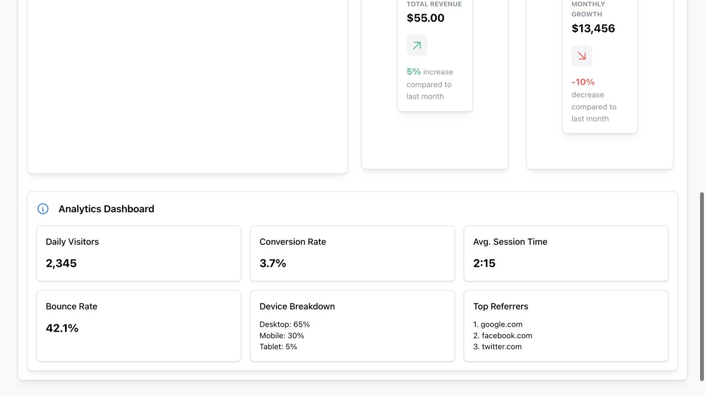

